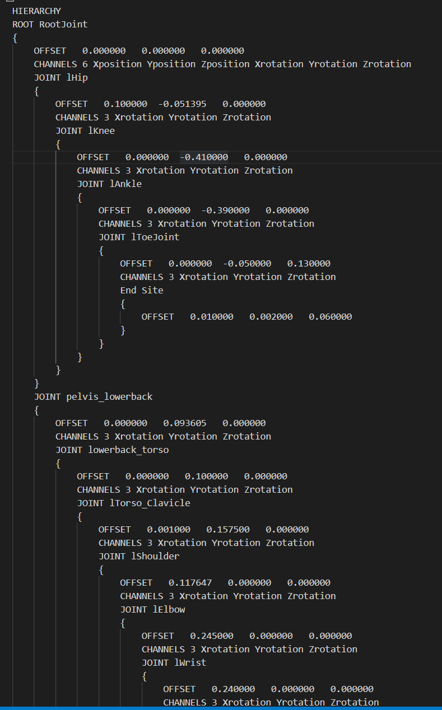
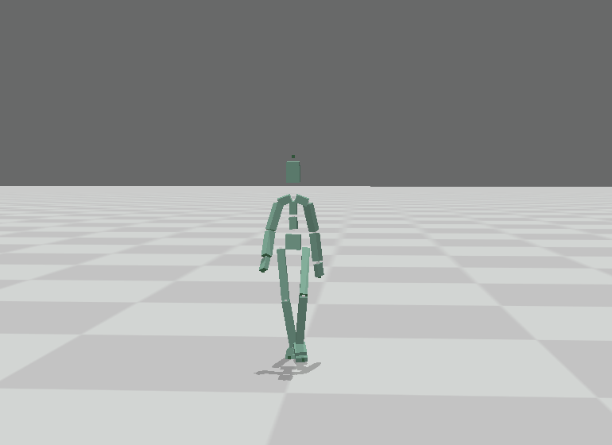
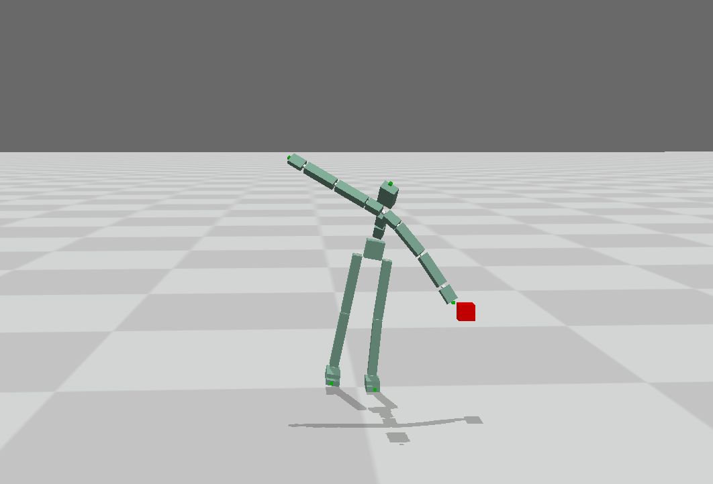
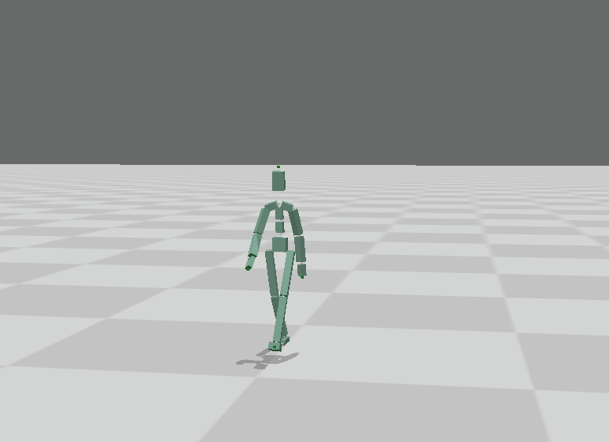
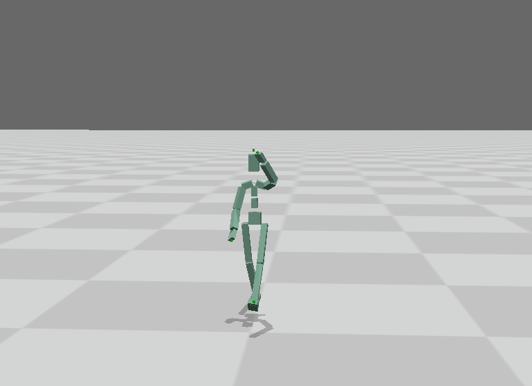

# Forward Kinematics

Resolve bvh flie , get the joint’s coordnidates of every frame and play it

the motion captured anime

# Inverse Kinematics

Resolve Inverse Kinematics problem with gradient descent iteration

## bvh data Inverse Kinematics

original bvh anime

modify with Inverse Kinematics

